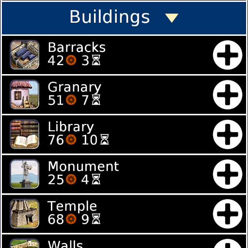

# Civ IV Icons for Unciv

[Unciv](https://github.com/yairm210/Unciv) mod for using the Civ IV graphics, art, and icons. Works well with the [Civ IV mod](https://github.com/yairm210/Unciv-IV-mod).

## Features

- Leader Portraits
- Buildings
- Tile Improvements
- Nations
- Policies
- Unit Promotions
- Religions
- Resources
- Technologies
- Units

## Source

1. Images are sourced from Civ IV via [Fandom](https://civilization.fandom.com/wiki/Civilization_IV)
2. Use [Upscayl](https://github.com/upscayl/upscayl) with UltraSharp 3x to port the Source folder to the Images folder
3. Run the game to pack the Textures

## Credits

All images were made and are owned by Firaxis Games.
